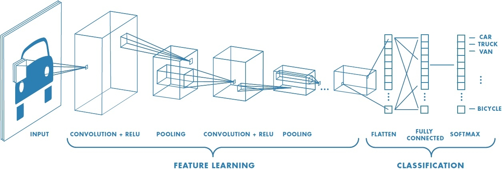

# Conv-Deconv-neural-network-

  # Introduction
 This project implements zeiler's method to visualize deconvolutional neural network using Pytorch [1]. A convolutional neural network is also implemented to help to test the result. A pretrained VGG16 model and a few pictures was been used for the networks. I wish to demonstrate an example of writing multiple neural networks using Pytorch to vision people, and a practice of using theories of CNN in real coding. 
 
 Although this tutorial only shows how to do Conv/ Deconv neural network in VGG16. People can certainly look through the process and modify the code to apply a new type of model.
 I will also include some instructions to help people modify to apply their model.

  Note: This project is based on Windows operating system. The code itself may noet be effected much, but errors caused by environment may happen in a different operating system.

[1] Zeiler, Matthew D. and R. Fergus. "Visualizing and Understanding Convolutional Networks." ECCV (2014).

  # Steps
  # 1.Install Anaconda
  
  Anaconda is a software toolkit that creates virtual Python environments. We will use python libraries installed through Anaconda to do this project.
  
  Download the [Anaconda for Windows](https://www.anaconda.com/products/individual) in this link (which direct to their website). Once it is donwloaded, execute the installer and follow the instructions to complete the installing process.
  
  # 2.Build up environment
  
  I will include a environment file in the files. If the files aren't working in your computer or you want to build your own environment follow instructions below
  
  **2a.How to create an environment from an environment.yml file**
  
  Use the file by issuring:
  
  ```
  conda env create -f environment.yml
  ```
  
  Then activate the environment file and check the environment:
  
 ```
 activate environmentName
 conda env list
 ```
  
  **2b. Set up a new Anaconda virtual environment**
  
  We are going to use 3.0 version of python and newest pytorch and torchvision. Use the following code to create an environment named CNN for your project:
  
  ```
  conda create -n CNN python=3
  ```
  
  Then activate the environment to use and install libraries in this environment by issuing:
  
  ```
  activate CNN
  ```
  
  Install pytorch and torchvision by issuing:
  
  ```
  conda install pytorch torchvision -c pytorch
  ```
  
  Install the other necessary packages by issuing the following commands:
  
  ```
  conda install jupyter
  conda install numpy scipy scikit-learn
  conda install cv2 pickle matplotlib
  ```
  
  Note: If the cv2 and pickle cannot be installed try following commands:
  ```
  conda install opencv-python
  conda install -c menpo opencv
  conda install -c conda-forge pickle5
  ```
  
  # 3. Write a convolutional neural network depending on VGG16
  
  Generally speaking convolutional neural networks (CNN) is a class of deep neural networks to analysis visual imagary. CNN is commonly used to deal with relatively small dataset. For more detailed information about CNN check [wikipedia on CNNs](https://en.wikipedia.org/wiki/Convolutional_neural_network).
  
  A general summary about architechture is shown by Figure1 and Figure2:
  
    
  [Figure1](http://cs231n.github.io/convolutional-networks/)
  
  
  [Figure2](http://cs231n.github.io/convolutional-networks/)
  
  VGG16 is one of VGG net. VGGs are a newly developed convolutional neural network which has high accuracy in ImageNet (which is one the on the largest data-set available). The VGG16 is a most commanly used in VGGs which is much deeper consisting 16 weight layers. 
  
  A summary about architechture is shown by Figure3 and Figure4:
  
  .jpg)  
  [Figure3](https://neurohive.io/en/popular-networks/vgg16/)
  
  .png)  
  [Figure4](https://neurohive.io/en/popular-networks/vgg16/)
  
  **3a. Building VGG16 convolutional neural network**
  
  In this section, we will implement a VGG16 convolutional neural network depending on pretrained network in PyTorch. 
  
Since our goal is to do deconvolution, we do not need Classification in our vgg16 structure. Therefoer, our Vgg16 only have Feature Learning part which contains 5 sections of layers, where first two layers use 2 conv&relu in each and last three layers use 3 layers use 3 conv&relu according to vgg16 structure. There are totally 30 layers in our structure.
      
  Vgg16 is implemented as a sequence in __init__ function. (It is important to know which layers are pooling layer, in other word, end of a section of layers, for writing deconvolution in the next part):
  
  ```
  self.conv_layers = nn.Sequential(
            nn.Conv2d(3,64,3,padding = 1),
            nn.ReLU(inplace=True),
            nn.Conv2d(64,64,3,padding = 1),
            nn.ReLU(inplace=True),
            nn.MaxPool2d(kernel_size=2,stride=2,return_indices=True),#4
            
            nn.Conv2d(64,128,3,padding = 1),
            nn.ReLU(inplace=True),
            nn.Conv2d(128,128,3,padding = 1),
            nn.ReLU(inplace=True),
            nn.MaxPool2d(kernel_size=2,stride=2,return_indices=True),#9
            
            nn.Conv2d(128,256,3,padding = 1),
            nn.ReLU(inplace=True),
            nn.Conv2d(256,256,3,padding = 1),
            nn.ReLU(inplace=True),
            nn.Conv2d(256,256,3,padding = 1),
            nn.ReLU(inplace=True),
            nn.MaxPool2d(kernel_size=2,stride=2,return_indices=True),#16
            
            nn.Conv2d(256,512,3,padding = 1),
            nn.ReLU(inplace=True),
            nn.Conv2d(512,512,3,padding = 1),
            nn.ReLU(inplace=True),
            nn.Conv2d(512,512,3,padding = 1),
            nn.ReLU(inplace=True),
            nn.MaxPool2d(kernel_size=2,stride=2,return_indices=True), #23
            
            nn.Conv2d(512,512,3,padding = 1),
            nn.ReLU(inplace=True),
            nn.Conv2d(512,512,3,padding = 1),
            nn.ReLU(inplace=True),
            nn.Conv2d(512,512,3,padding = 1),
            nn.ReLU(inplace=True),
            nn.MaxPool2d(kernel_size=2,stride=2,return_indices=True), #30
        )
  ```
  
  Before __init__ function end we need to add this code to load pretrained modle in torch.nn.model (the function needed will be implemented in following code):
  
  ```
  self.load_pretrained(trained_model)
  ```
  **3b. Functions for VGG16 convolutional neural networks class**
  
  We will also write a function to load pretrained network and a forword to prepare parameters for deconvolution.
  
  First we need to build a load_pretrained function which takes the trained_model and apply trained data on our VGG16. (Since we are only here try to do the deconvolution, training a vgg16 is not our main task.):
  
  ```
  def load_pretrained(self, trained_model):
        for i, layer in enumerate(trained_model.features):
            if isinstance(layer,nn.Conv2d):
                self.conv_layers[i].weight.data = layer.weight.data
                self.conv_layers[i].bias.data = layer.bias.data
  ```
  
Then, in order to do the deconvolution we need a forward function for this class to generate intermidiate_features and maxpool_indices for each section of layers after this vgg16 processed an image (maxpool_indices recorded variables from each pooling region):

```
def forward(self,image):
        maxpool_indices = {}
        intermidiate_features = []
        for i,layer in enumerate(self.conv_layers):
            if isinstance(layer,nn.MaxPool2d):
                image, indices = layer(image)
                maxpool_indices[i] = indices
                intermidiate_features.append(image)
            else:
                image = layer(image)
                intermidiate_features.append(image)
        return intermidiate_features,maxpool_indices
```
  
  # 4. Write a deconvolutional neural network depending on VGG16
  Zeiler's method maps intermedian features back to input pixel speces through a reverse path. According to it, we will need the Unpooling (which place the recorded variables from each pooling region to appropriate locations), the Rectification (which is just same as conv one, a relu non-linearity), and Filtering (which uses same filters in deconv process but with flipping each filter vertically and horizontally) to build that recerse path. Then, we can reconstruct the image depending on this structure.
  
  Figure_5 from [1] explaining the deconvolution process:
    
  Figure5
  
  
  **4a. Implement a reversed conv2d**
  
  At this step, we construct our reverseconv2d very similar to conv2d, except we need to flip each filter vertically and horizontally. So, we just copy each data of parameters from conv2d, but do the flipping in treanpose2d.weight.data.
  
  ```
  def __init__(self,trained_layer,in_channels,out_channels,kernel_size,stride=1,padding=0,output_padding=0,groups=1,bias=True,dilation=1,
                 padding_mode='zeros'):
        super(ReverseConv2d, self).__init__()
        self.transpose2d = nn.Conv2d(in_channels,out_channels,kernel_size,stride=stride,padding=padding,dilation=dilation,bias=False,groups=groups,padding_mode=padding_mode)
        
        self.transpose2d.weight.data = trained_layer.weight.data.permute(1, 0, 3, 2)
        self.bias = trained_layer.bias.data
        self.use_bias = bias
  ```
 
  This forward function just simplly return the intermidiate feature which is processed from previous feature to next layer (Since each layer is connected):
  
  ```
  def forward(self,deconv_input):
        print(self.transpose2d.weight.data.shape)
        if (self.use_bias):
            return self.transpose2d(deconv_input-self.bias[None,:,None,None])
        return self.transpose2d(deconv_input)
  ```
  
  **4b. Building VGG16 deconvolutional neural network**
  
  The structure of a VGG16 deconvolutional neural network is processing image in a back path way. Now, we have first three layers use 3 conv&relu in each section of layers and last two layers use 2 conv&relu, according to vgg16 structure backword. There are totally 30 layers in our structure. According to the __init__ function we write in reversed conv2d class, now we need to align each RevConv2d in deconv_layers to each conv_layers respectively and correspodingly.
  
  ```
  self.deconv_layers = nn.Sequential(
            nn.MaxUnpool2d(kernel_size=2,stride=2),
            nn.ReLU(inplace=True),
            RevConv2d.ReverseConv2d(trained_model.conv_layers[28],512,512,3,padding = 1),
            nn.ReLU(inplace=True),
            RevConv2d.ReverseConv2d(trained_model.conv_layers[26],512,512,3,padding = 1),
            nn.ReLU(inplace=True),
            RevConv2d.ReverseConv2d(trained_model.conv_layers[24],512,512,3,padding = 1),
            
            nn.MaxUnpool2d(kernel_size=2,stride=2),
            nn.ReLU(inplace=True),
            RevConv2d.ReverseConv2d(trained_model.conv_layers[21],512,512,3,padding = 1),
            nn.ReLU(inplace=True),
            RevConv2d.ReverseConv2d(trained_model.conv_layers[19],512,512,3,padding = 1),
            nn.ReLU(inplace=True),
            RevConv2d.ReverseConv2d(trained_model.conv_layers[17],512,256,3,padding = 1),
            
            nn.MaxUnpool2d(kernel_size=2,stride=2),
            nn.ReLU(inplace=True),
            RevConv2d.ReverseConv2d(trained_model.conv_layers[14],256,256,3,padding = 1),
            nn.ReLU(inplace=True),
            RevConv2d.ReverseConv2d(trained_model.conv_layers[12],256,256,3,padding = 1),
            nn.ReLU(inplace=True),
            RevConv2d.ReverseConv2d(trained_model.conv_layers[10],256,128,3,padding = 1),
            
            nn.MaxUnpool2d(kernel_size=2,stride=2),
            nn.ReLU(inplace=True),
            RevConv2d.ReverseConv2d(trained_model.conv_layers[7],128,128,3,padding = 1),
            nn.ReLU(inplace=True),
            RevConv2d.ReverseConv2d(trained_model.conv_layers[5],128,64,3,padding = 1),
            
            nn.MaxUnpool2d(kernel_size=2,stride=2),
            nn.ReLU(inplace=True),
            RevConv2d.ReverseConv2d(trained_model.conv_layers[2],64,64,3,padding = 1),
            nn.ReLU(inplace=True),
            RevConv2d.ReverseConv2d(trained_model.conv_layers[0],64,3,3,padding = 1),
        )
  ```
  
  **4c. Implement a reconstruction function for VGG16 deconvolution**
 
 We use the intermidiate_features and the max_pool derived from forward function from conv class to build all the way back to reconstruct the input image. The maxpool_indices are used to place the recorded variables from each pooling region to appropriate locations. It is important to set the start_index to decide which layer you want to start to reconstruct, which means you are going ignore the features before that layer.
 
 ```
 def reconstruct(self,intermidiate_features,maxpool_indices,start_index):
        reconstructed_feature = intermidiate_features[start_index]
        deconv_start_index = len(self.deconv_layers) - start_index - 1
        for i in range(deconv_start_index, len(self.deconv_layers)):
            print(reconstructed_feature.shape,i)
            if isinstance (self.deconv_layers[i], nn.MaxUnpool2d):
                current_layer_index = len(self.deconv_layers) - i - 1
                current_indices = maxpool_indices[current_layer_index]
                reconstructed_feature = self.deconv_layers[i](reconstructed_feature, current_indices)
            else:
                reconstructed_feature = self.deconv_layers[i](reconstructed_feature)
        return reconstructed_feature
 ```
  
  # 5. Try use main.py file to conv-deconv an image.
  
  Now, we just need to compile our code together into one file to use it processing a few images to test our code performance.
  
  Below is the part where we compile conv and deconv together to reconstruct image (Operations are commented in main.py check for further detail):
  
  ```
  #operating on vgg16
conv_VGG16_model = conv.vgg16(pretrained_vgg16_model)
intermidiate_features,maxpool_indices = conv_VGG16_model.forward(img)
print('vgg16 loaded')
#Change start_index here to adjust the model to get a clear image
input_start = input('Enter start_index:')
start_index = input_start; #recommanded use 3 in first time.
deconv_VGG16_model = deconv.deconvolve_vgg16(conv_VGG16_model)
result_img = deconv_VGG16_model.reconstruct(intermidiate_features,maxpool_indices,start_index)
print('model reconstructed')
  ```
  
  Now we input an image (77394-gr.jpeg) to main.py and set its stat_index as 3:
  
  ```
  (CNN) D:\CNN\conv deconv neural net>python main.py
Enter path of the image:D:\CNN\Dataset\77394-gr.jpeg
image loaded
vgg16 loaded
Enter start_index:3
torch.Size([1, 64, 224, 224]) 27
torch.Size([1, 64, 224, 224]) 28
torch.Size([64, 64, 3, 3])
torch.Size([1, 64, 224, 224]) 29
torch.Size([1, 64, 224, 224]) 30
torch.Size([3, 64, 3, 3])
model reconstructed
  ```
  
  Then we select the path to save our reconstructed image (include its name):
  
  ```
  Enter the path to save the image(including its name):D:\CNN\Dataset\reconstructed_77394.jpeg
(224, 224, 3)
Successfully completed
  ```
  
  Now we go to our path we will find our reconstructed image (compare to original):
  
    
  original one
  
    
  reconstructed with start_index 3
  
  We can try different start index and compare them to visualize CNN performance layer by layer:
  
    
  reconstructed with start_index 1
  
    
  reconstructed with start_index 5
  
    
  reconstructed with start_index 8
  
    
  reconstructed with start_index 10
  
    
  reconstructed with start_index 13
  
  And we can use different image input to our program:
  
  First one:
  
    
  original one
  
    
  reconstructed with start_index 3
  
    
  reconstructed with start_index 8
  
  Second one:
  
    
  original one
  
    
  reconstructed with start_index 3
  
    
  reconstructed with start_index 8
  
  Third one:
  
    
  original one
  
    
  reconstructed with start_index 3
  
    
  reconstructed with start_index 8
  

  
  
